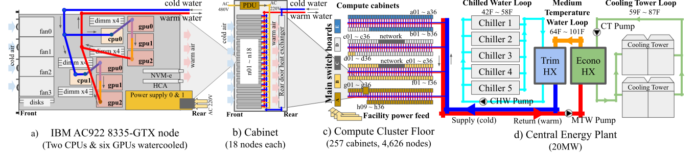

# HPC Power and Thermal Characteristics in the Wild

#### Woong Shin, J. Austin Ellis, Ahmad Maroof Karimi, Vladyslav Oles, Sajal Dash, and Feiyi Wang   Oak Ridge National Laboratory, 1 Bethel Valley Road, Oak Ridge, TN 37830 USA  *[shinw, ellisja, karimiahmad, olesv, dashs, fwang2]@ornl.gov*

# Abstract

In this data challenge, we aim to understand the long-term power \& thermal trends of a 200PF pre-exascale supercomputer at the Oak Ridge Leadership Computing Facility (OLCF), Summit.  Contenders will work on a sampled subset of the high-resolution per-component (GPUs, CPUs) power consumption and thermal measurements from the system and address the provided data challenges that will encourage the development of novel insights and techniques that can potentially help HPC system operations. 

Keywords: HPC data center, power and thermal character, system reliability and sustainability, energy efficiency, operational data

# 1 Introduction

Modern HPC is heavily impacted by the first law of thermodynamics. Especially, in this near exascale era, far into the post Moore regime, meeting the ever-increasing computing needs in HPC now comes with significant challenges in managing power and thermal issues due to the large energy footprint these systems require. HPC sites need to find a sweet spot between system performance, energy efficiency and longevity by providing the right amount of energy consumption for thermal management and keeping the temperatures of system components as high as possible without harming them.  In such a balancing act, an accurate understanding of the power and thermal behavior of the system is crucial.   

However, acquiring such understanding is not a trivial task due to the influences of the “wild”. In principle, power and thermal behavior can be modeled using simple analytical equations coming from thermodynamic laws, but the longevity of the harsh conditions (5 years or more), combined with the large variances found in the large component populations (a few tens of thousands of devices) on the compute floor makes it difficult to accurately assess their long-term behavior. Such unknown aspects of the system may result in increase of operational cost due to significant conservatism, or even catastrophic loss in system hardware due to miscalculation or projection.  To sustain the successes in HPC, it is crucial to understand the nature of this variability and devise methods to monitor and control these long-term effects. 
 
To this end, the OLCF has performed an initial overview analysis [1] and is now presenting one of its largest operational datasets from the Summit supercomputer to enable community participation in devising novel techniques for understanding, monitoring and controlling long-term effects. With a subsampled system component dataset that has adequate representational detail of the time and space variables, contenders will address data challenges that will encourage development novel understandings, insights or automated techniques that can address real challenges HPC systems experience in the wild. 

# 2 Data Description

## 2.1 Acquisition

The dataset for this challenge was collected from the Summit HPC data center which includes power and energy data sensors. In particular, we have leveraged an out-of-band telemetry stream, accumulating data for during portions of years 2020, 2021, and 2022 at a 1Hz sampling rate from all 4,626 nodes, 100 metrics per node that cover the power and temperature of individual components within each node. The collected dataset is expected to enable the data scientist and engineers to deeply characterize the tendencies of Summit’s power behavior and reveal its short-term and long-term impact on the HPC data center. Due to the extreme size of the data and considering the availability of limited time and resources we publish only a sample of the full dataset. However, we share the description of the fields in the datasets in the following section. 

SMC2022 Github Page: [`https://github.com/at-aaims/summit_power_and_thermal_data/tree/main/events/smc2022`](https://github.com/at-aaims/summit_power_and_thermal_data/tree/main/events/smc2022)  
Dataset Download (DOI): [`https://doi.ccs.ornl.gov/ui/doi/380`](https://doi.ccs.ornl.gov/ui/doi/380)  
Dataset Companion Github [`https://github.com/at-aaims/summit_power_and_thermal_data`](https://github.com/at-aaims/summit_power_and_thermal_data)

## 2.2 Characterizations

- Dataset A: The first dataset (`a_fullperiod_10sec_58hosts_decomp.tar`, `a_fullperiod_10sec_100hosts.tar`) consists of 58 Summit nodes and 100 summit nodes. The datasets contain power and thermal data for each subcomponent (2 CPUs and 6 GPUs) for the months of 202001, 202008, 202102, 202108, and 202201, where the format is `yyyymm`. The data files are in the parquet file format, and each file contains data for a single day, e.g., 20220110.parquet is for January 10, 2022. The size of both directories is about 4.3 GB. 
 
- Dataset B: The second dataset consists of a uniform random sampling of 3k Summit node snapshots. Each snapshot contains thermal and power averages of 10-second intervals over 1 day, which results in a dataset of 1.1 gigabytes. 
 
- Dataset C: The third dataset consists of a new uniform random sampling of 4.6k (all nodes for one day) + 14k Summit node snapshots. Each snapshot contains thermal and power averages of 1-minute intervals over 1 day, which results in a dataset of 1.9 gigabytes. 

- Dataset D: The fourth dataset includes 1-minute interval averages of total five 24-hour periods each randomly picked from each month period.  Compared to other datasets, this dataset includes power and temperature measurements from all 4,626 nodes.  With approximately 0.8 gigabytes per 24-hour sample, this dataset is 4.1 gigabytes.

## 2.3 Details

Summit has 4,626 nodes, and each node has two CPUs (IBM Power-9 processors) and six GPUs (Nvidia Volta V100 processors). The six GPUs are arranged in 2 sockets, 3 GPUs in each. The two CPUs in each node are labeled CPU0 and CPU1. Similarly, GPUs are labeled as GPU0, GPU1, and GPU2 in socket 1 and GPU3, GPU4, and GPU5 in socket 2. 

1. Power (Watts)
    1. CPU0 – Power consumed by CPU0 
    2. GPU0-2 – Power consumed by the 3 GPUs in socket 1 
    3. CPU1 – Power Consumed by CPU1 
    4. GPU3-5 – Power consumed by the 3 GPUs in socket 2 
2. Thermal (Celsius) 
    1. CPU0 – Temperature readings for CPU0 
    2. GPU0-2 – Temperature readings for the 3 GPUs in socket 1 
    3. CPU1 – Temperature readings for CPU1 
    4. GPU3-5 – Temperature readings for the 3 GPUs in socket 2 
 

**Fig. 1.** Architectural overview of the Summit system at Oak Ridge Leadership Computing Facility

# 3 Challenges

## 3.1 Visualizing power and thermal trends in time and space

The goal is to devise a visualization technique that is optimized for its coverage in the number of sensors, time, and 3D space of the physical location where it still maintains the ability to provide useful insights in understanding the general relationships between, power, temperature, time and location altogether.  

- Contenders should develop either provide a single visualization that can achieve such high coverage and heavy insights.  Or provide an interactive series of visualizations (no more than 3 in depth of such series) that gradually uncovers the nature of the trends. 

## 3.2 Applications of ML methods for pattern recognition

The objective is to discover important shifts in the operating conditions in terms of power and temperature usage behavior. One of the crucial tasks is identifying the dominating patterns in power consumption and temperature fluctuation, i.e., rise or fall. Capturing both the frequency and magnitude of these fluctuations is essential in understanding the HPC operations. The rate of change of the above metrics/slope (power and temperature) is another important characteristic that reflects the behavior of HPC usage. 

- Analyze the behavior of slopes and identify significant patterns related to slopes and infer the reasons for the behavior for such HPC usage.  
- Given the power and temperature data, can you develop methods that can cluster the changes into different classes and infer the explanation for similarities.  

## 3.3 Advanced Descriptive Analysis of System Data

Summit users have varying processing and memory needs across their allocated CPUs and GPUs depending on their computing needs, which drives the system's change in temperature and power consumption. 

- How do temperatures and powers associated with these resources change over time? What are the variabilities in these metrics within a day, a week, and across seasons? 

Compute nodes (identified by the field "hostname") are housed in cabinets and spatially localized, and the actual floor map is given in Figure 1(c).

- Do spatial organizations have an impact on energy and power consumption? Is it possible to construct a coarse floor map based on these metrics? One constraint is that the floor map should not change over time.

## 3.4 Comparing Data-driven Models with a Physics Cooling Model

Consider the water cooling temperature rise equation,  

(1) ΔT = q / (mdot x Cp),

where ΔT is the temperature rise in degrees Celsius, q is the dissipated power in Watts, mdot is the mass flow rate of the water coolant in gallons per minute (GPM), and Cp is the constant specific heat of water (4.186 Joules per grams per degrees Celsius). 

- Given (1) and that the cooling system uses a constant mass flow rate, does the power and thermal data support this physics model? If not, what forms of deviation do you observe? Is there a time or spatial dependence on the deviations? Are there modifications to this equation that would improve its accuracy? Can you formulate a purely data-driven model to contrast the physics model?

- Given the node layout diagram in Figure 1(a), can you expand the physics model to the node-level temperature changes (2 CPUs and 6 GPUs vs a single device model) that takes into account the direction and split of the cooling flow? The coolant temperature flowing into the node is roughly 21°C, so what does the model predict the water temperatures to be between each component and at the node exit?

# Resources

Helpful resources in understanding and utilizing this data set.

1. Data collection methodology, understanding of the Summit System, and related analysis
    - [Revealing power, energy and thermal dynamics of a 200PF pre-exascale supercomputer](https://doi.org/10.1145/3458817.3476188): full scale power & thermal analysis with the original dataset, architectural information and details of the data collection methodologies
    - [Hybrid Approach to HPC Cluster Telemetry and Hardware Log Analytics](https://doi.org/10.1109/HPEC43674.2020.9286239): details of the per-node data collection method provided by IBM.
2. Cooling system design and architectural information
    - [Summit and Sierra supercomputer cooling solutions](https://doi.org/10.1147/JRD.2019.2958902): Details of the IBM AC922 cooling design
    - [Thermal and Mechanical Design of the Fastest Supercomputer of the World in Cognitive Systems: IBM POWER AC 922](https://asmedigitalcollection.asme.org/InterPACK/proceedings/InterPACK2019/59322/V001T02A006/1071715): Another article about the details of the IBM AC922 cooling design
3. General information about the OLCF Summit Supercomputer
    - [SUMMIT: Oak Ridge National Laboratory's 200 petaflop supercomputer](https://www.olcf.ornl.gov/olcf-resources/compute-systems/summit/): general information about the Summit supercomputer
    - [User Guide](https://docs.olcf.ornl.gov/systems/summit_user_guide.html#): general user guide
    - [Virtual tour for the Summit system](https://www.olcf.ornl.gov/2020/08/10/take-a-virtual-tour-of-ornls-supercomputer-center/): A close-up detailed virtual tour of the Summit compute floor and its central energy plant

# References

[1] Woong Shin, Vladyslav Oles, Ahmad Maroof Karimi, J. Austin Ellis, and Feiyi
Wang. Revealing power, energy and thermal dynamics of a 200PF pre-exascale su-
percomputer. In *Proceedings of the International Conference for High Performance
Computing, Networking, Storage and Analysis*, SC ’21, New York, NY, USA, 2021.
Association for Computing Machinery.
